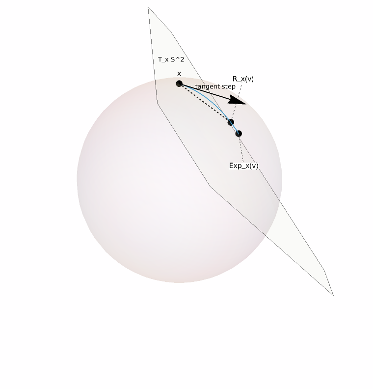

# Geometry of Constrained State Spaces
<!-- ATLAS-CH-GEOM-001 -->

**Epistemic status:** mathematical exposition based on standard Riemannian and matrix-manifold geometry, with Atlas-owned elementary derivations.  
**Primary figure:** \`ATLAS-FIG-MANIFOLD-001\`  
**Derivation packet:** \`mathematics/derivations/ATLAS-CH-GEOM-001-DERIVATIONS.md\`

## 1. The space you write in is not always the space you may move in

Machine learning often presents objects in ambient Euclidean coordinates. A unit vector lives in \(\mathbb R^d\). An orthonormal frame is stored as an array in \(\mathbb R^{n\times p}\). A subspace may be represented by many different matrices.

Coordinates are convenient. They can also hide constraints.

If a state must satisfy

\[
\|x\|=1,
\]

then an arbitrary Euclidean step \(x\mapsto x-\eta g\) will generally leave the admissible set. If a matrix must satisfy

\[
X^\top X=I,
\]

then an arbitrary matrix update will generally destroy orthogonality.

The geometric question is therefore:

> What are the legal local directions, and how do we turn them into legal finite moves?

The useful allegory is a **cartographer walking on a mountain**.

The map coordinates are the ambient coordinates. The mountain surface is the admissible state space. A tangent plane gives a locally linear set of legal directions. A geodesic stays intrinsically on the surface. A retraction takes a locally legal direction and returns a nearby ambient step to the constraint.

The limit of the allegory is important. A manifold need not be a visible surface in three-dimensional space, and a retraction need not be an orthogonal projection. The image teaches constrained motion, not all of differential geometry.

## 2. Ambient space and admissible space

A smooth embedded manifold \(M\subseteq\mathbb R^N\) is locally well approximated by a linear space even though \(M\) need not itself be linear [@Lee2018Riemannian].

At a point \(x\in M\), the tangent space

\[
T_xM
\]

contains the velocities of differentiable curves through \(x\).

If

\[
\gamma:(-\varepsilon,\varepsilon)\to M,
\qquad
\gamma(0)=x,
\]

then

\[
\dot\gamma(0)\in T_xM.
\]

This gives a recurring Atlas pattern:

\[
\boxed{
\text{constrained object}
\longrightarrow
\text{tangent linearization}
\longrightarrow
\text{local update}
\longrightarrow
\text{return to the constraint}.
}
\]

The tangent space is linear. The manifold is not.

That distinction will later let us separate “what direction should the optimizer choose?” from “how should the chosen direction be represented as a legal state update?”

## 3. The unit sphere

Consider

\[
S^{d-1}
=
\{x\in\mathbb R^d:x^\top x=1\}.
\]

Let \(\gamma(t)\in S^{d-1}\) with

\[
\gamma(0)=x,
\qquad
\dot\gamma(0)=v.
\]

Because the curve remains on the sphere,

\[
\gamma(t)^\top\gamma(t)=1.
\]

Differentiate at \(t=0\):

\[
2x^\top v=0.
\]

Hence

\[
\boxed{
T_xS^{d-1}
=
\{v\in\mathbb R^d:x^\top v=0\}.
}
\]

The tangent space is the hyperplane orthogonal to \(x\).

If \(g\in\mathbb R^d\) is an arbitrary ambient direction, its tangent component is

\[
g_{\rm tan}
=
g-(x^\top g)x.
\]

The geometry has already changed the update rule. The radial component is not a legal first-order direction.

## 4. Retractions: step locally, return legally

A retraction \(R_x:T_xM\to M\) is a smooth local map satisfying, at minimum,

\[
R_x(0)=x
\]

and

\[
DR_x(0)=\operatorname{id}_{T_xM}.
\]

For the sphere, a simple retraction is normalization:

\[
\boxed{
R_x(v)
=
\frac{x+v}{\|x+v\|},
\qquad
v\in T_xS^{d-1}.
}
\]

Why is this a valid first-order retraction?

Set

\[
r(t)
=
\frac{x+tv}{\|x+tv\|}.
\]

Because \(x^\top v=0\) and \(\|x\|=1\),

\[
r'(0)=v.
\]

So the map agrees with the tangent direction to first order while returning every sufficiently small step to the sphere.

This is a common numerical idea: do the difficult reasoning in a linear tangent space, then use a controlled map back to the nonlinear constraint.

Matrix-manifold optimization develops this pattern systematically [@AbsilMahonySepulchre2008].

## 5. Retraction is not exponential map

The Riemannian exponential map moves along a geodesic.

On the unit sphere, for nonzero \(v\in T_xS^{d-1}\),

\[
\operatorname{Exp}_x(v)
=
\cos(\|v\|)x
+
\sin(\|v\|)
\frac{v}{\|v\|}.
\]

The normalized retraction is

\[
R_x(v)
=
\frac{x+v}{\sqrt{1+\|v\|^2}},
\]

because \(x^\top v=0\).

Both are legal maps back to the sphere. They are not the same map.

For small \(v\),

\[
\operatorname{Exp}_x(v)
=
x+v-\frac{\|v\|^2}{2}x+O(\|v\|^3),
\]

and

\[
R_x(v)
=
x+v-\frac{\|v\|^2}{2}x+O(\|v\|^3).
\]

They agree through the first-order retraction requirement and share the same quadratic radial correction, but differ at higher order.

This distinction matters later. “Geometry-aware” should not become a vague synonym for “normalize after every step.”

## 6. The primary geometric plate

The Atlas figure fixes

\[
x=(0,0,1),
\qquad
v=(0.8,0,0).
\]

Since

\[
x^\top v=0,
\]

\(v\) is tangent to the sphere at \(x\).

The figure shows:

- the unit sphere;
- the tangent plane at \(x\);
- the tangent vector \(v\);
- the spherical exponential-map endpoint;
- the normalized-retraction endpoint;
- the great-circle direction.

The plate is partly schematic. Perspective, tangent-plane extent, and label placement are pedagogical. The plotted points themselves are generated from the stated equations.

Its purpose is to make one fact visible:

> a tangent vector belongs to a linear space, but a finite update must still be interpreted through the manifold.

## 7. Geodesics and spherical distance

On a Riemannian manifold, a geodesic generalizes the idea of a locally straight path.

For unit vectors \(x,y\in S^{d-1}\), define their angle

\[
\theta
=
\arccos(x^\top y),
\qquad
0\le\theta\le\pi.
\]

For non-antipodal endpoints, the shorter great-circle distance is

\[
d_{S}(x,y)=\theta.
\]

The ambient chord distance is

\[
\|x-y\|
=
2\sin\frac{\theta}{2}.
\]

For small \(\theta\),

\[
2\sin\frac{\theta}{2}
=
\theta+O(\theta^3),
\]

so local Euclidean distance approximates geodesic distance.

Globally they are different.

This is a simple example of a recurring principle: local linearization can be excellent without making the global geometry flat.

## 8. SLERP: interpolate on the sphere

Let

\[
x^\top y=\cos\theta,
\qquad
0<\theta<\pi.
\]

Spherical linear interpolation is

\[
\boxed{
\operatorname{SLERP}(x,y;t)
=
\frac{\sin((1-t)\theta)}{\sin\theta}x
+
\frac{\sin(t\theta)}{\sin\theta}y,
\qquad
0\le t\le1.
}
\]

Shoemake introduced SLERP in quaternion interpolation for computer animation [@Shoemake1985]. The underlying formula is simply great-circle interpolation on a sphere.

Writing

\[
\alpha
=
\frac{\sin((1-t)\theta)}{\sin\theta},
\qquad
\beta
=
\frac{\sin(t\theta)}{\sin\theta},
\]

we obtain

\[
\|\alpha x+\beta y\|^2
=
\alpha^2+\beta^2+2\alpha\beta\cos\theta
=
1.
\]

So the path remains on the unit sphere exactly.

There are two important boundaries:

- as \(\theta\to0\), the apparent singularity is removable;
- at \(\theta=\pi\), the shortest geodesic is not unique, so an additional directional choice is required.

The antipodal singularity is geometric information, not merely a numerical nuisance.

## 9. Stiefel geometry: orthonormal frames

For \(X\in\mathbb R^{n\times p}\), the Stiefel manifold is

\[
\operatorname{St}(n,p)
=
\{X:X^\top X=I_p\}.
\]

Its points are ordered orthonormal \(p\)-frames.

Let \(X(t)\in\operatorname{St}(n,p)\) and set

\[
X(0)=X,
\qquad
\dot X(0)=Z.
\]

Differentiate

\[
X(t)^\top X(t)=I_p.
\]

At \(t=0\),

\[
Z^\top X+X^\top Z=0.
\]

Therefore

\[
\boxed{
T_X\operatorname{St}(n,p)
=
\{Z:X^\top Z+Z^\top X=0\}.
}
\]

This is the matrix analogue of the sphere condition \(x^\top v=0\).

The Stiefel manifold is especially important in optimization with orthogonality constraints; Edelman, Arias, and Smith provide a canonical geometric treatment [@EdelmanAriasSmith1998].

## 10. Grassmann geometry: the frame is not the subspace

A Stiefel matrix \(X\) stores an ordered orthonormal basis.

But if the object of interest is only the \(p\)-dimensional subspace spanned by its columns, then

\[
X
\]

and

\[
XQ,
\qquad
Q\in O(p),
\]

represent the same subspace.

The Grassmann manifold identifies all such frames:

\[
\boxed{
\operatorname{Gr}(n,p)
\cong
\operatorname{St}(n,p)/O(p).
}
\]

This is the first important quotient-geometry example in the Atlas.

A parameterization can contain distinctions that the represented object does not.

Later, when we discuss semantic equivalence and benign nonconvexity, this pattern returns in a broader form:

> if two parameter states represent the same functional object, should the optimization landscape distinguish them?

The Grassmannian gives a clean finite-dimensional case where the answer is no.

## 11. Geometry changes what an optimizer is allowed to do

Suppose \(f:M\to\mathbb R\).

In ambient coordinates, automatic differentiation may give an ordinary gradient \(\nabla f\). A manifold-aware method must convert that ambient information into a tangent direction and then map a finite step back to \(M\).

Schematically,

\[
\nabla f
\longrightarrow
\operatorname{Proj}_{T_xM}(\nabla f)
\longrightarrow
v
\longrightarrow
R_x(v).
\]

The exact Riemannian gradient depends on the chosen metric, and later chapters will treat that carefully.

The present chapter establishes the more basic point:

> constraints are part of the state geometry, so they should appear in the update mathematics rather than only as after-the-fact repairs.

## 12. Four mistakes to avoid

### Mistake 1: “The tangent space is the manifold.”

No. It is a local linearization at one point.

### Mistake 2: “Normalization is the exponential map.”

No. On the sphere it is a useful retraction, not the same finite map as geodesic motion.

### Mistake 3: “A Stiefel point and a Grassmann point are the same object.”

No. The first is an ordered frame; the second is a subspace modulo basis change.

### Mistake 4: “Local Euclidean behavior means the space is globally Euclidean.”

No. Local tangent approximations coexist with global curvature and topological structure.

## 13. Atlas connections

**Normalized representations.**  
Unit-norm states move naturally on spheres rather than unconstrained Euclidean space.

**Optimization on manifolds.**  
Tangent gradients, retractions, and matrix manifolds turn the present geometry into algorithms.

**Position geometry.**  
Rotations and spherical constructions recur in positional encodings.

**Representation as transport.**  
A representation update can be treated as motion through a constrained state space.

**Quotient geometry.**  
Grassmann geometry supplies the simplest durable example of removing representational redundancy.

The recurring Atlas shift is:

\[
\boxed{
\text{parameters as coordinates}
\longrightarrow
\text{parameters as points in a structured state space}.
}
\]

## 14. Closing view

The mountain allegory is useful only until the mathematics becomes visible.

A constrained representation has an admissible state space. At each point, tangent geometry tells us which first-order motions are legal. Geodesics describe intrinsic motion. Retractions provide practical finite updates. Quotient geometry tells us when different coordinates describe the same underlying object.

The map is not the territory.

The ambient coordinates are not the admissible state space.

## References used in this chapter

- [@Lee2018Riemannian]
- [@AbsilMahonySepulchre2008]
- [@EdelmanAriasSmith1998]
- [@Shoemake1985]

See \`sources/source-locks/ATLAS-CH-GEOM-001.yaml\` for exact source identities and claim scope.
