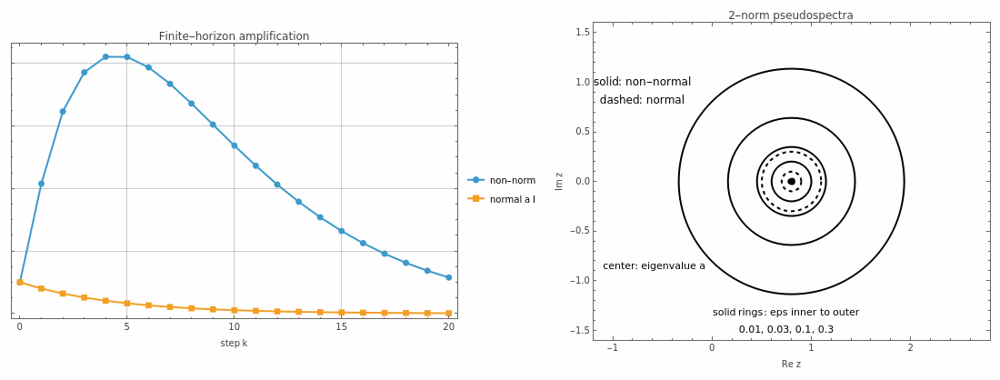

# Normality, Pseudospectra, and Transient Growth
<!-- ATLAS-CH-NONNORMAL-001 -->

**Epistemic status:** mathematical exposition based on standard matrix analysis and pseudospectral theory, with Atlas-owned finite-dimensional derivations.  
**Primary figure:** \`ATLAS-FIG-PSPECTRUM-001\`  
**Derivation packet:** \`mathematics/derivations/ATLAS-CH-NONNORMAL-001-DERIVATIONS.md\`

## 1. Stable eigenvalues can tell an incomplete story

Suppose every eigenvalue of a matrix lies strictly inside the unit disk.

For a normal matrix, this strongly controls the powers of the matrix. For a non-normal matrix, it may not control what happens over the first few steps.

The key distinction is between:

\[
\text{asymptotic spectral behavior}
\]

and

\[
\text{finite-horizon amplification}.
\]

A matrix can satisfy

\[
\rho(A)<1
\]

and still have

\[
\|A^k\|_2>1
\]

for some finite \(k\).

This chapter explains exactly how.

The useful allegory is **aligned currents in a harbor**.

Each current may eventually decay, but if their directions are badly aligned, motion can transfer among them in a way that produces a temporary surge.

The correspondence is:

- modal decay ↔ eigenvalues inside the unit disk;
- non-orthogonal modal geometry ↔ non-normality;
- temporary surge ↔ transient norm growth.

The limit is strict. A matrix need not represent a fluid. The analogy is only about geometric interaction among directions.

## 2. Normality

A real matrix \(A\) is normal when

\[
A^\top A=AA^\top.
\]

For complex matrices, transpose is replaced by conjugate transpose.

Normal matrices admit an orthogonal/unitary eigenbasis. In the real symmetric or complex normal setting,

\[
A=U\Lambda U^*,
\]

with \(U\) unitary.

Then

\[
A^k=U\Lambda^kU^*,
\]

so

\[
\|A^k\|_2
=
\|\Lambda^k\|_2
=
\max_i|\lambda_i|^k
=
\rho(A)^k.
\]

Thus if

\[
\rho(A)<1,
\]

the operator norm decays monotonically with \(k\).

For normal matrices, eigenvalue geometry and singular-value growth align unusually well [@HornJohnson2012].

## 3. Non-normality breaks that alignment

If \(A\) is diagonalizable but non-normal,

\[
A=V\Lambda V^{-1},
\]

then

\[
A^k
=
V\Lambda^kV^{-1},
\]

so

\[
\|A^k\|_2
\le
\kappa_2(V)\rho(A)^k,
\]

where

\[
\kappa_2(V)=\|V\|_2\|V^{-1}\|_2.
\]

A badly conditioned eigenvector matrix can therefore permit substantial finite-horizon amplification even when every eigenmode decays.

The deeper contrast is not simply

\[
\text{diagonalizable}
\quad\text{versus}\quad
\text{non-diagonalizable}.
\]

It is closer to

\[
\text{orthogonal modal geometry}
\quad\text{versus}\quad
\text{non-orthogonal modal geometry}.
\]

Normality removes the amplification associated with geometric misalignment of eigen-directions.

## 4. The smallest useful counterexample

Consider

\[
A=
\begin{pmatrix}
a&K\\
0&a
\end{pmatrix},
\qquad
|a|<1.
\]

Write

\[
A=aI+KN,
\qquad
N=
\begin{pmatrix}
0&1\\
0&0
\end{pmatrix},
\qquad
N^2=0.
\]

For each integer \(n\ge 2\), the nilpotent binomial expansion truncates:

\[
A^n
=
a^nI
+
n a^{n-1}KN.
\]

For these \(n\), therefore

\[
\boxed{
A^n
=
\begin{pmatrix}
a^n&nKa^{n-1}\\
0&a^n
\end{pmatrix}.
}
\]

The low powers are \(A^0=I\) and \(A^1=A\). Treating them separately avoids the \(a^0\) convention at \(a=0\).

The eigenvalue is always \(a\), with algebraic multiplicity two, so

\[
\rho(A)=|a|.
\]

If \(|a|<1\), then \(A^n\to0\).

But the off-diagonal term

\[
nKa^{n-1}
\]

can first grow before eventual decay.

The matrix is asymptotically stable and can still amplify some perturbations strongly over a finite horizon.

## 5. Singular values expose the amplification

For

\[
B=
\begin{pmatrix}
p&q\\
0&p
\end{pmatrix},
\]

we have

\[
B^\top B
=
\begin{pmatrix}
p^2&pq\\
pq&p^2+q^2
\end{pmatrix}.
\]

Its eigenvalues are

\[
\lambda_{\pm}
=
\frac{
2p^2+q^2
\pm
|q|\sqrt{4p^2+q^2}
}{2}.
\]

The spectral norm is therefore

\[
\boxed{
\|B\|_2
=
\sqrt{
\frac{
2p^2+q^2
+
|q|\sqrt{4p^2+q^2}
}{2}
}.
}
\]

For \(B=A^n\) with \(n\ge 2\),

\[
p=a^n,
\qquad
q=nKa^{n-1}.
\]

This is an exact finite-horizon gain formula.

Nothing in the eigenvalue set alone displays the \(q\)-term.

## 6. A matched normal comparison

The Atlas witness fixes

\[
a=\frac45,
\qquad
K=4.
\]

Then

\[
A=
\begin{pmatrix}
4/5&4\\
0&4/5
\end{pmatrix}.
\]

Compare it with

\[
N_0=\frac45I.
\]

Both matrices have exactly the same eigenvalue set:

\[
\left\{\frac45,\frac45\right\}.
\]

For the normal matrix,

\[
\|N_0^n\|_2
=
\left(\frac45\right)^n.
\]

For the non-normal matrix, Wolfram evaluation gives

\[
\max_{0\le n\le40}\|A^n\|_2
=
8.2124290544\ldots
\]

at

\[
n=4.
\]

The two matrices have the same eigenvalue story and radically different finite-time stories.

## 7. The primary figure

The left panel compares

\[
\|A^n\|_2
\]

against

\[
\|N_0^n\|_2.
\]

The right panel compares their \(\varepsilon\)-pseudospectral boundaries.

The plate is not merely numerical decoration. For this \(2\times2\) example, the pseudospectral radii are available in closed form.

## 8. The pseudospectrum

We use the closed \(2\)-norm convention

\[
\boxed{
\Lambda_\varepsilon(A)
=
\left\{
z\in\mathbb C:
\sigma_{\min}(zI-A)\le\varepsilon
\right\}.
}
\]

Outside the spectrum,

\[
\|(zI-A)^{-1}\|_2
=
\frac1{\sigma_{\min}(zI-A)},
\]

so equivalently,

\[
\Lambda_\varepsilon(A)
=
\sigma(A)
\cup
\left\{
z:
\|(zI-A)^{-1}\|_2\ge\varepsilon^{-1}
\right\}.
\]

Another equivalent finite-dimensional characterization is:

\[
z\in\Lambda_\varepsilon(A)
\]

if and only if \(z\) is an eigenvalue of \(A+E\) for some perturbation satisfying

\[
\|E\|_2\le\varepsilon.
\]

These equivalent views connect pseudospectra to both resolvent growth and eigenvalue sensitivity [@TrefethenEmbree2005].

## 9. Exact pseudospectrum of the \(2\times2\) example

For

\[
A=
\begin{pmatrix}
a&K\\
0&a
\end{pmatrix},
\qquad
K>0,
\]

write

\[
z-a=\delta,
\qquad
r=|\delta|.
\]

Then

\[
zI-A
=
\begin{pmatrix}
\delta&-K\\
0&\delta
\end{pmatrix}.
\]

Its squared singular values are

\[
\sigma_{\pm}^2
=
\frac{
2r^2+K^2
\pm
K\sqrt{K^2+4r^2}
}{2}.
\]

On the \(\varepsilon\)-pseudospectral boundary,

\[
\sigma_{\min}=\varepsilon.
\]

Because the product of the singular values is

\[
|\det(zI-A)|=r^2,
\]

we have

\[
\sigma_{\max}
=
\frac{r^2}{\varepsilon}.
\]

The sum of squared singular values is

\[
\sigma_{\max}^2+\sigma_{\min}^2
=
2r^2+K^2.
\]

Substituting gives

\[
\frac{r^4}{\varepsilon^2}
+
\varepsilon^2
=
2r^2+K^2.
\]

Hence

\[
(r^2-\varepsilon^2)^2
=
K^2\varepsilon^2.
\]

The admissible boundary branch is

\[
\boxed{
r^2
=
\varepsilon(\varepsilon+K).
}
\]

Therefore

\[
\boxed{
\Lambda_\varepsilon(A)
=
\left\{
z:
|z-a|
\le
\sqrt{\varepsilon(\varepsilon+K)}
\right\}.
}
\]

For the normal comparison \(N_0=aI\),

\[
\boxed{
\Lambda_\varepsilon(N_0)
=
\{z:|z-a|\le\varepsilon\}.
}
\]

The eigenvalue plot is identical.

The perturbation neighborhood is not.

For small \(\varepsilon\),

\[
\sqrt{\varepsilon(\varepsilon+K)}
\sim
\sqrt{K\varepsilon},
\]

which can be much larger than \(\varepsilon\).

## 10. Why pseudospectra matter

Eigenvalues answer:

> Where are the exact modal growth factors?

Pseudospectra ask:

> How sensitive is that spectral picture, and how large can the resolvent become nearby?

For normal matrices, \(\varepsilon\)-pseudospectra are simply \(\varepsilon\)-neighborhoods of the spectrum in the \(2\)-norm.

For non-normal matrices they can expand far beyond those neighborhoods.

This enlargement signals that small perturbations can move eigenvalues much farther than the ordinary eigenvalue plot suggests, and that resolvent response can be large.

Pseudospectra are therefore a way to visualize **spectral fragility**.

They are not a causal diagnosis by themselves.

## 11. Transient growth in broader non-normal systems

The importance of non-normal transient growth is not peculiar to the Atlas toy matrix. It has a substantial literature in hydrodynamic stability, where decaying eigenmodes can combine to produce substantial transient energy growth [@ReddySchmidHenningson1993; @TrefethenEtAl1993].

Those examples motivate the general lesson without making a direct identification with neural optimization.

The Atlas will use the mathematics, not import the application wholesale.

Later, when an optimizer-state Jacobian or router linearization is non-normal, the correct question is not:

> Is this secretly a fluid?

It is:

> Can non-orthogonal dynamical directions create finite-horizon amplification that an eigenvalue-only analysis misses?

## 12. What the Wolfram witness establishes

For the exact matrix pair

\[
A=
\begin{pmatrix}
4/5&4\\
0&4/5
\end{pmatrix},
\qquad
N_0=\frac45I,
\]

the witness establishes:

1. identical eigenvalues;
2. exact powers of \(A\);
3. large finite-horizon \(2\)-norm gain for \(A\);
4. monotone decay for \(N_0\);
5. exact non-normal pseudospectral radius
   \[
   \sqrt{\varepsilon(\varepsilon+4)};
   \]
6. normal pseudospectral radius
   \[
   \varepsilon.
   \]

The witness does **not** establish:

- that every non-normal system exhibits large transient growth;
- that transient growth implies asymptotic instability;
- that broad pseudospectra identify a causal mechanism in a trained model;
- that one norm is universally privileged.

## 13. Five mistakes to avoid

### Mistake 1: “Non-normal means unstable.”

No. The worked matrix satisfies \(\rho(A)<1\) and \(A^n\to0\).

### Mistake 2: “Stable eigenvalues imply monotone decay.”

No. The worked matrix amplifies strongly before decaying.

### Mistake 3: “A transient spike proves divergence.”

No. Finite-horizon gain and asymptotic divergence are different.

### Mistake 4: “Pseudospectra replace eigenvalues.”

No. They supplement the spectral picture by adding perturbation and resolvent information.

### Mistake 5: “Broad pseudospectra explain a neural failure.”

No. They expose a possible amplification mechanism. Causal attribution requires additional evidence.

## 14. Atlas connections

**Spectral shaping.**  
An optimizer that changes singular structure may alter transient behavior even when eigenvalue summaries appear similar.

**Optimizer-State Dynamics.**  
The augmented optimizer Jacobian can inherit exactly the stable-but-amplifying structure developed here.

**Router dynamics.**  
Routing systems can possess non-normal local update operators and finite-horizon amplification.

**Spectral diagnostics.**  
Eigenvalues, singular values, pseudospectra, and finite-horizon propagators become complementary diagnostic objects.

The recurring Atlas shift is:

\[
\boxed{
\text{Where are the eigenvalues?}
\longrightarrow
\text{What can this operator do to perturbations over the horizon that matters?}
}
\]

## 15. Closing view

Eigenvalues are not wrong.

They are sometimes incomplete.

Normal matrices make eigenvalue geometry unusually transparent. Non-normal matrices can hide large finite-time behavior in the geometry of their directions.

Pseudospectra reveal part of that hidden sensitivity.

The aligned-currents allegory is only an intuition pump.

The operator norm, resolvent, singular values, and pseudospectrum are the objects.

## References used in this chapter

- [@HornJohnson2012]
- [@TrefethenEmbree2005]
- [@ReddySchmidHenningson1993]
- [@TrefethenEtAl1993]

See \`sources/source-locks/ATLAS-CH-NONNORMAL-001.yaml\` for exact source identities and claim scope.
