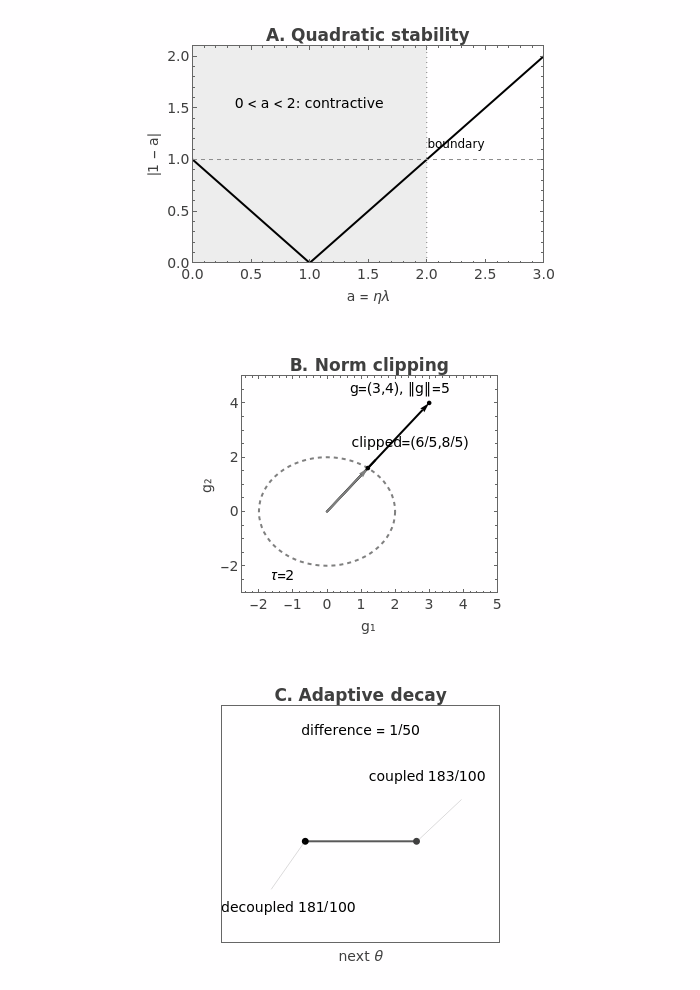

# First-Order Optimization
<!-- ATLAS-CH-OPTBASE-001 -->

**Epistemic status:** Established Theory + Bounded Deep-Learning Practice + Exact Computational Witness  
**Specification:** manuscript/specifications/ATLAS-CH-OPTBASE-001.md  
**Derivation packet:** mathematics/derivations/ATLAS-CH-OPTBASE-001-DERIVATIONS.md  
**Computational witness:** mathematics/computational-witnesses/ATLAS-CW-OPTBASE-001.md  
**Source lock:** sources/source-locks/ATLAS-CH-OPTBASE-001.yaml

## 1. The gradient is not the optimizer

Under the Euclidean inner product on parameter coordinates, the gradient answers a local question:

> Among unit Euclidean directions, which infinitesimal direction increases the objective fastest?

For nonzero gradient, that direction is

\[
\frac{\nabla F}{\|\nabla F\|_2}.
\]

Its negative is the Euclidean steepest-descent direction.

Later geometry chapters will change the metric and therefore change what “steepest” means.

An optimizer answers a different question:

> Given that signal, how should the parameters actually move?

That second question introduces choices:

- step size;
- momentum;
- stochastic sampling;
- coordinatewise scaling;
- clipping;
- weight decay;
- schedules;
- initialization;
- optimizer state.

The Atlas therefore treats

\[
g_k
\]

and

\[
\Delta\theta_k
\]

as different objects.

The gradient is a signal.

The optimizer converts that signal into motion.

## 2. Steering versus changing the road

A useful allegory is steering a vehicle down a sloped landscape.

The gradient indicates local downhill direction.

The learning rate controls how far we move.

Momentum carries history.

A preconditioner changes the coordinatewise steering response.

Clipping acts like a speed limiter.

Weight decay adds shrinkage.

A schedule changes the control policy over time.

The structural correspondence is useful.

The literal-mechanics analogy is not.

Optimization state is algorithmic state, not physical momentum unless a specific mathematical correspondence is established.

## 3. Gradient descent

For a differentiable objective

\[
F(\theta),
\]

gradient descent uses

\[
\boxed{
\theta_{k+1}
=
\theta_k-\eta\nabla F(\theta_k).
}
\]

This is already a discrete dynamical system:

\[
\theta_{k+1}
=
\Psi(\theta_k).
\]

The learning rate \(\eta\) is not simply a “speed” parameter.

It changes the discrete map itself.

A step size can therefore alter stability.

## 4. Exact quadratic calibration

Take

\[
F(x)
=
\frac{\lambda}{2}x^2,
\qquad
\lambda>0.
\]

Then

\[
\nabla F(x)
=
\lambda x,
\]

so

\[
x_{k+1}
=
(1-\eta\lambda)x_k.
\]

Thus

\[
x_k
=
(1-\eta\lambda)^k x_0.
\]

The dynamics are completely determined by the scalar amplification factor

\[
r
=
1-\eta\lambda.
\]

## 5. Step-size stability

For asymptotic convergence to zero,

\[
|r|<1.
\]

Therefore

\[
|1-\eta\lambda|<1,
\]

which gives

\[
\boxed{
0<\eta<\frac{2}{\lambda}.
}
\]

At

\[
\eta=0,
\]

the iterate does not move.

At

\[
\eta=\frac2\lambda,
\]

the factor is \(-1\), so the iterate alternates sign without decaying.

Beyond that boundary, the discrete method diverges.

*Corrected-edition figure candidate:* This plate is the Wolfram Language 15.0.1 evaluator derivative in `figures/derivatives/ATLAS-FIG-OPTBASE-001-v0.1.2.yaml`, which replaces the malformed historical Wolfram `GraphicsGrid` layout without changing the toy mathematics. The earlier Matplotlib derivative remains separately attributed as a superseded editorial alternative. The original Wolfram source and master remain unchanged. Print-scale and accessibility acceptance of the derivative is still pending under #324.

## 6. Curvature sets the useful scale

The bound

\[
0<\eta<\frac2\lambda
\]

belongs to the declared quadratic curvature \(\lambda\).

Change the curvature and the stability range changes.

For a multidimensional quadratic with Hessian eigenvalues

\[
\lambda_i,
\]

one expects the most restrictive positive curvature scale to limit a simple constant step.

This is the first hint that optimization should be read spectrally, not only coordinatewise.

Later chapters will develop that point.

## 7. Full gradient versus stochastic gradient

Suppose

\[
F(\theta)
=
\mathbb E_\xi[\ell(\theta;\xi)].
\]

A stochastic-gradient method uses a random sample or minibatch gradient

\[
g(\theta;\xi)
\]

in place of the exact expectation.

The ideal unbiased relation is

\[
\mathbb E_\xi[g(\theta;\xi)]
=
\nabla F(\theta).
\]

Unbiasedness is an expectation statement.

It says nothing by itself about variance.

## 8. Exact unbiased-SGD witness

Take two sample losses:

\[
\ell_1(x)
=
\frac12(x-1)^2,
\]

\[
\ell_2(x)
=
\frac12(x+1)^2.
\]

Sample uniformly.

The finite-average objective is

\[
F(x)
=
\frac12(\ell_1+\ell_2)
=
\frac12x^2+\frac12.
\]

Therefore

\[
\nabla F(x)=x.
\]

The sample gradients are

\[
g_1=x-1,
\qquad
g_2=x+1.
\]

Their expectation is

\[
\frac12(g_1+g_2)=x.
\]

So the estimator is unbiased.

Its variance is

\[
1.
\]

Thus:

\[
\boxed{
\text{unbiased}
\not\Rightarrow
\text{low variance}.
}
\]

Robbins and Monro provide the foundational stochastic-approximation setting behind this distinction [@RobbinsMonro1951].

## 9. Noise can be useful and harmful

Stochasticity can:

- reduce per-step cost;
- perturb iterates out of narrow regions;
- act as implicit regularization;
- increase estimator variance;
- destabilize large steps;
- complicate convergence diagnostics.

There is no single sign.

A gradient-noise model must be tied to:

- sampling scheme;
- batch size;
- data distribution;
- optimizer;
- current parameter state.

The Atlas will not treat “SGD noise” as one universal distribution.

## 10. Momentum adds state

One heavy-ball convention is

\[
v_{k+1}
=
\beta v_k+g_k,
\]

\[
\theta_{k+1}
=
\theta_k-\eta v_{k+1}.
\]

The optimizer state is now

\[
s_k=(\theta_k,v_k).
\]

This is a conceptual change.

The update no longer depends only on the current gradient.

It depends on history carried in \(v_k\).

Polyak's work supplies the classical acceleration context [@Polyak1964].

## 11. Momentum conventions differ

Some implementations define velocity with the opposite sign.

Some absorb \(\eta\) into the momentum variable.

Some write updates directly as parameter differences.

Therefore two formulas both called “momentum” need not look identical.

The Atlas uses equations, not labels, as the canonical object.

This discipline becomes essential when we later study optimizer-state Jacobians.

## 12. Nesterov-style lookahead

A common lookahead form evaluates the gradient at a predicted state:

\[
g_k
=
\nabla F(\theta_k-\eta\beta v_k),
\]

followed by

\[
v_{k+1}
=
\beta v_k+g_k,
\]

\[
\theta_{k+1}
=
\theta_k-\eta v_{k+1}.
\]

The important structural change is:

> the gradient is evaluated at a lookahead point rather than the current parameter point.

Nesterov's convex-optimization theory gives the classical accelerated context [@Nesterov2004].

The Atlas does not transfer convex rate guarantees automatically to deep nonconvex networks.

## 13. Deep-learning momentum

Sutskever and colleagues provide an influential deep-learning study of momentum and initialization [@SutskeverEtAl2013].

That work is useful here as a bridge between classical first-order machinery and practical neural-network training.

It is not used to rank momentum universally above all alternatives.

## 14. AdaGrad

AdaGrad accumulates squared gradients coordinatewise:

\[
G_{k,i}
=
G_{k-1,i}
+
g_{k,i}^2.
\]

A standard coordinate update is

\[
\theta_{k+1,i}
=
\theta_{k,i}
-
\eta
\frac{g_{k,i}}
{\sqrt{G_{k,i}}+\varepsilon}.
\]

Coordinates with large historical squared gradients receive smaller effective step scales [@DuchiHazanSinger2011].

This is more than a changing learning rate.

It is coordinate-dependent scaling.

## 15. Adaptive scaling as a diagonal geometry

Write a generic first-order update as

\[
\theta_{k+1}
=
\theta_k
-
\eta P_k g_k,
\]

where \(P_k\) is diagonal and positive.

When

\[
P_k=I,
\]

we recover ordinary gradient descent.

When \(P_k\) depends on accumulated gradient statistics, the algorithm changes the relative step size across coordinates.

This is the beginning of a geometric viewpoint.

Later Atlas chapters will replace diagonal scaling with richer matrix and manifold structure.

## 16. RMSProp

RMSProp uses an exponential moving average of squared gradients:

\[
v_k
=
\rho v_{k-1}
+
(1-\rho)g_k^2,
\]

coordinatewise.

Then

\[
\theta_{k+1}
=
\theta_k
-
\eta
\frac{g_k}
{\sqrt{v_k}+\varepsilon}.
\]

The original RMSProp description is course lecture material rather than a peer-reviewed paper [@TielemanHinton2012].

The Atlas marks that source status explicitly.

## 17. Adam

Adam combines two moving averages [@KingmaBa2015].

First moment:

\[
m_k
=
\beta_1m_{k-1}
+
(1-\beta_1)g_k.
\]

Second raw moment:

\[
v_k
=
\beta_2v_{k-1}
+
(1-\beta_2)g_k^2.
\]

With zero initialization, both estimates are biased toward zero early in training.

Adam corrects that initialization bias.

## 18. Bias correction

The corrected moments are

\[
\hat m_k
=
\frac{m_k}{1-\beta_1^k},
\]

and

\[
\hat v_k
=
\frac{v_k}{1-\beta_2^k}.
\]

A standard update is

\[
\theta_{k+1}
=
\theta_k
-
\eta
\frac{\hat m_k}
{\sqrt{\hat v_k}+\varepsilon}.
\]

Bias correction is an algebraic adjustment.

It is not a proof that the full optimizer is unbiased or universally convergent.

## 19. Exact Adam first step

Take

\[
g_1=3,
\]

\[
\beta_1=\frac9{10},
\]

\[
\beta_2=\frac{99}{100},
\]

with

\[
m_0=v_0=0.
\]

Then

\[
m_1=\frac3{10},
\]

and

\[
v_1=\frac9{100}.
\]

After bias correction:

\[
\hat m_1=3,
\]

\[
\hat v_1=9.
\]

For the calibration

\[
\varepsilon=0,
\]

the normalized direction is exactly

\[
1.
\]

Practical implementations use nonzero epsilon.

The zero-epsilon witness exists only to isolate the correction algebra.

## 20. Adaptive methods are not one algorithm

AdaGrad, RMSProp, and Adam all use gradient-history information.

But they differ in:

- accumulation versus exponential forgetting;
- first-moment state;
- bias correction;
- denominator construction;
- epsilon placement;
- update ordering.

Treating them as one generic “adaptive optimizer” can hide mathematically important differences.

## 21. Gradient clipping

Global norm clipping at threshold \(\tau\) uses

\[
g_{\rm clip}
=
g
\min\left(
1,
\frac{\tau}{\|g\|_2}
\right).
\]

If the norm is below threshold, nothing changes.

If the norm is above threshold, the vector is rescaled to norm \(\tau\).

Pascanu, Mikolov, and Bengio discuss clipping in the context of exploding gradients in recurrent networks [@PascanuMikolovBengio2013].

## 22. Exact clipping geometry

Take

\[
g=(3,4).
\]

Then

\[
\|g\|_2=5.
\]

With threshold

\[
\tau=2,
\]

the scale factor is

\[
2/5.
\]

Therefore

\[
\boxed{
g_{\rm clip}
=
(6/5,8/5).
}
\]

Its norm is exactly

\[
2.
\]

The direction is unchanged in this global-norm scheme.

The magnitude is not.

## 23. Clipping changes the estimator

Clipping is nonlinear.

Therefore in general

\[
\mathbb E[\operatorname{clip}(g)]
\neq
\operatorname{clip}(\mathbb E[g]).
\]

Even if the original stochastic gradient is unbiased,

\[
\mathbb E[g]
=
\nabla F,
\]

the clipped gradient need not remain unbiased.

This is not necessarily a defect.

It is simply a different estimator/update rule.

The distinction should be explicit.

## 24. Weight decay and L2 regularization

For plain gradient descent, adding an L2 penalty

\[
\frac{\lambda}{2}\|\theta\|^2
\]

produces gradient contribution

\[
\lambda\theta.
\]

The update becomes

\[
\theta^+
=
\theta-\eta(g+\lambda\theta).
\]

Rearranging,

\[
\theta^+
=
(1-\eta\lambda)\theta-\eta g.
\]

In this simple setting, L2 regularization and multiplicative weight shrinkage coincide algebraically.

That equivalence does not survive arbitrary preconditioning.

## 25. Coupled regularization under adaptive scaling

Suppose a scalar preconditioner \(p\) scales the gradient.

If L2 regularization is coupled into the gradient,

\[
\theta_{\rm c}^+
=
\theta-\eta p(g+\lambda\theta).
\]

The preconditioner acts on the shrinkage gradient too.

This changes the effective decay.

## 26. Decoupled weight decay

AdamW separates shrinkage from the adaptive gradient step [@LoshchilovHutter2019AdamW].

In the scalar calibration:

\[
\theta_{\rm d}^+
=
(1-\eta\lambda)\theta
-
\eta p g.
\]

Subtracting coupled from decoupled gives

\[
\boxed{
\theta_{\rm c}^+
-
\theta_{\rm d}^+
=
\eta\lambda\theta(1-p).
}
\]

They coincide only under special conditions.

## 27. Exact decay counterexample

Take

\[
\theta=2,
\quad
g=3,
\quad
p=\frac12,
\quad
\eta=\frac1{10},
\quad
\lambda=\frac15.
\]

Coupled regularization gives

\[
\theta_{\rm c}^+
=
\frac{183}{100}.
\]

Decoupled decay gives

\[
\theta_{\rm d}^+
=
\frac{181}{100}.
\]

The exact difference is

\[
\boxed{
\frac1{50}.
}
\]

So under adaptive scaling:

\[
\boxed{
\text{coupled L2}
\neq
\text{decoupled weight decay}
}
\]

in general.

## 28. Learning-rate schedules

A constant learning rate uses

\[
\eta_k=\eta.
\]

A schedule makes the step scale time-dependent:

\[
\eta_k.
\]

Common patterns include:

- piecewise decay;
- exponential or inverse-power decay;
- cosine schedules;
- warmup plus decay.

A schedule changes the optimization dynamics over training time.

It is therefore part of the algorithm, not cosmetic metadata.

## 29. Warmup

Warmup deliberately begins with smaller step scales.

One influential example is the Transformer schedule of Vaswani et al., which combines warmup with inverse-square-root scaling [@VaswaniEtAl2017].

The Atlas treats warmup as a training recipe with many possible rationales:

- unstable early statistics;
- large transient gradients;
- poorly calibrated optimizer moments;
- scale changes during early representation formation.

No universal theorem says that warmup is always necessary or optimal.

## 30. Initialization is part of optimization

Optimization starts before the first update.

The initial parameter distribution determines:

- activation scale;
- gradient scale;
- symmetry breaking;
- saturation risk;
- early Jacobian statistics.

Initialization therefore belongs in the optimization baseline.

It defines the starting state of the dynamical system.

## 31. Fan-in second moment

Consider

\[
z
=
\sum_{i=1}^{n}w_i x_i.
\]

Assume:

- independent zero-mean weights;
- independent zero-mean inputs;
- weight/input independence;
- common input second moment \(q\);
- common weight variance \(\sigma_w^2\).

Cross terms vanish.

Therefore

\[
\boxed{
\mathbb E[z^2]
=
n\sigma_w^2q.
}
\]

This is the mathematical core of fan-in scaling.

## 32. Linear second-moment preservation

To keep

\[
\mathbb E[z^2]
=
q,
\]

choose

\[
\sigma_w^2
=
\frac1n.
\]

Glorot and Bengio analyze related variance/saturation issues in deep feedforward networks [@GlorotBengio2010].

The derivation depends on its assumptions.

Real network activations are not guaranteed to remain independent or identically distributed across depth.

## 33. ReLU second moment

Suppose the preactivation distribution is symmetric around zero.

Then

\[
\operatorname{ReLU}(z)^2
=
z^2\mathbf 1_{\{z>0\}}.
\]

By symmetry,

\[
\mathbb E[\operatorname{ReLU}(z)^2]
=
\frac12\mathbb E[z^2].
\]

Therefore

\[
\mathbb E[\operatorname{ReLU}(z)^2]
=
\frac12 n\sigma_w^2q.
\]

Choose

\[
\boxed{
\sigma_w^2
=
\frac2n
}
\]

to preserve the second moment.

He and colleagues develop rectifier-aware initialization in this direction [@HeEtAl2015].

## 34. Second moment is not variance after ReLU

This wording matters.

ReLU output generally has positive mean.

Therefore

\[
\operatorname{Var}[\operatorname{ReLU}(z)]
\neq
\mathbb E[\operatorname{ReLU}(z)^2]
\]

unless the mean term is handled.

The simple \(2/n\) derivation above is an exact second-moment statement under symmetry assumptions.

It should not be inflated into an exact theorem about full deep-network activation distributions.

## 35. Optimization is a state machine

The simplest gradient method has state

\[
\theta_k.
\]

Momentum has

\[
(\theta_k,v_k).
\]

Adam has

\[
(\theta_k,m_k,v_k).
\]

Schedules introduce time or step counters.

Mixed precision may introduce loss-scaling state.

Gradient accumulation introduces buffering state.

So even “first-order optimization” quickly becomes a structured state machine.

This prepares the later Optimizer-State Dynamics chapter.

## 36. Coordinate scaling already hints at geometry

Ordinary gradient descent treats parameter coordinates through the Euclidean metric implicit in

\[
\nabla F.
\]

Adaptive methods introduce coordinate-dependent scales.

That raises a question the baseline does not answer:

> Which geometry should determine steepest descent?

Natural gradient, mirror descent, Shampoo, Muon, manifold methods, and MODULUS all answer that question differently.

They belong downstream.

## 37. Spectral effects are still hidden

The scalar quadratic example had one curvature scale \(\lambda\).

Real parameter blocks can have many singular/eigen directions.

A diagonal adaptive method sees only coordinatewise statistics.

It does not directly diagonalize the true curvature or account for non-normal transient behavior.

That gap motivates:

- second-order methods;
- matrix preconditioning;
- spectral shaping;
- optimizer-state diagnostics.

## 38. Five failure modes

### Large step mistaken for fast learning

Beyond the stability boundary, a larger step can destroy convergence.

### Unbiased mistaken for low variance

The exact SGD witness has variance \(1\) despite being unbiased.

### Clipping mistaken for harmless rescaling

Clipping changes the estimator whenever the threshold is active.

### Coupled L2 mistaken for AdamW decay

Adaptive scaling breaks the simple equivalence.

### Initialization heuristic mistaken for distribution theorem

Fan-in calculations rely on assumptions that deep networks can violate.

## 39. What would falsify an optimizer story?

A useful optimizer explanation should predict something measurable.

Examples:

- stability boundary;
- update norm;
- coordinate scale;
- momentum phase lag;
- decay behavior;
- clipping activation rate;
- variance propagation;
- sensitivity to schedule.

If the predicted mechanism is absent, the explanation is incomplete.

The Atlas will use this standard later when testing optimizer geometry and state dynamics.

## 40. Atlas connections

**Dynamics.**  
An optimizer defines a discrete dynamical system, often with hidden state.

**Second-order optimization.**  
Curvature information can replace or augment first-order scaling.

**Manifold optimization.**  
The notion of allowable motion changes when parameters live on constrained spaces.

**Spectral shaping.**  
Matrix updates can be designed around singular/eigen structure rather than coordinates.

**Muon.**  
Orthogonalized or spectrally shaped updates depart sharply from diagonal adaptive scaling.

**CPS.**  
Optimizer-state Jacobians expose coupling and transient instability invisible in static update formulas.

**Curriculum.**  
The optimization state interacts with which examples or tasks are presented.

## 41. Closing view

First-order optimization begins with a simple equation:

\[
\theta_{k+1}
=
\theta_k-\eta g_k.
\]

But practical training rapidly adds structure:

\[
\text{gradient}
\to
\text{stochastic estimator}
\to
\text{state}
\to
\text{preconditioner}
\to
\text{clip}
\to
\text{decay}
\to
\text{schedule}.
\]

Each addition changes the actual dynamical system.

That is the central lesson.

The baseline is not “gradient descent plus tricks.”

It is a family of stateful rules that translate local first-order information into parameter motion.

Later Atlas chapters will ask whether those rules should instead be derived from:

- curvature;
- geometry;
- spectra;
- manifolds;
- variational principles;
- compositional contracts.

To ask that question rigorously, we first needed to say exactly what the conventional baseline is.

## References used in this chapter

- [@RobbinsMonro1951]
- [@Polyak1964]
- [@Nesterov2004]
- [@DuchiHazanSinger2011]
- [@TielemanHinton2012]
- [@KingmaBa2015]
- [@LoshchilovHutter2019AdamW]
- [@PascanuMikolovBengio2013]
- [@GlorotBengio2010]
- [@HeEtAl2015]
- [@SutskeverEtAl2013]
- [@VaswaniEtAl2017]

See \`sources/source-locks/ATLAS-CH-OPTBASE-001.yaml\` for exact source roles and claim boundaries.
